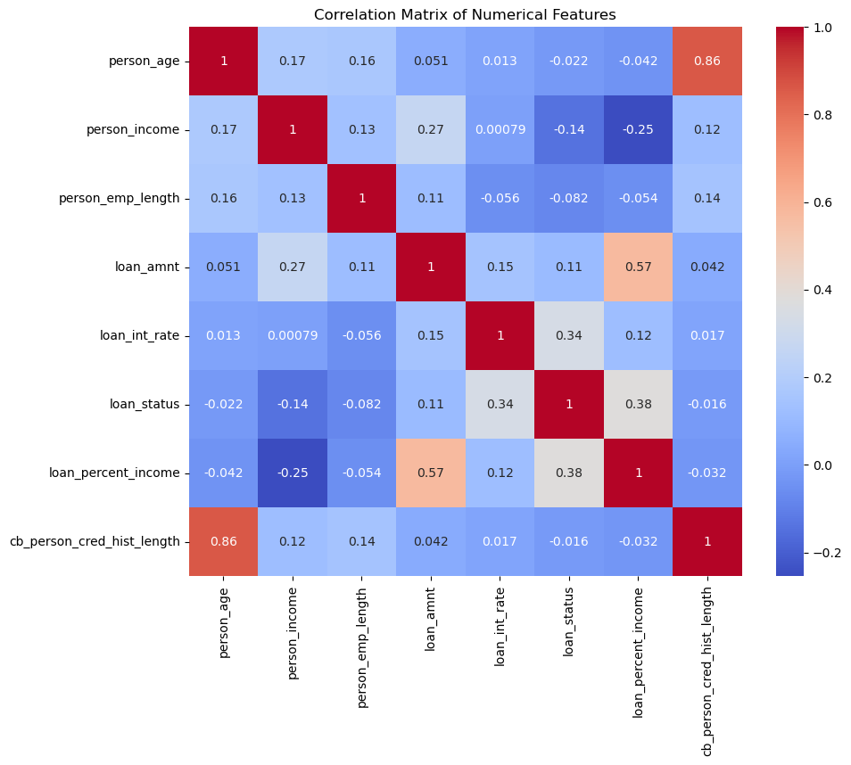
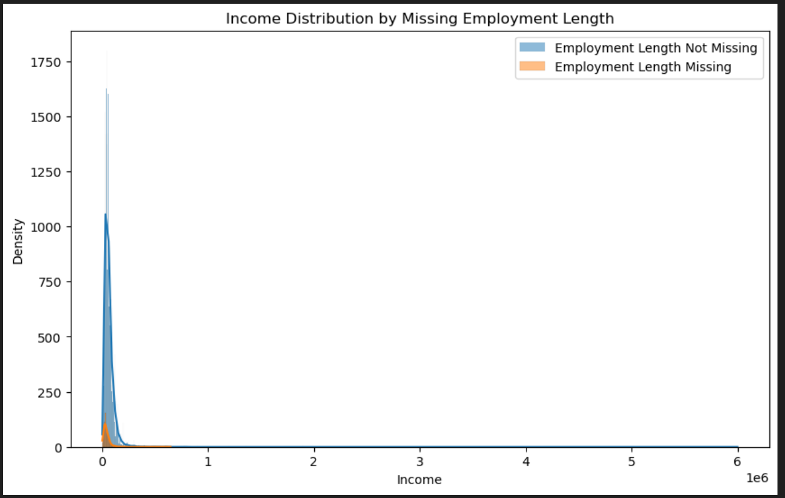
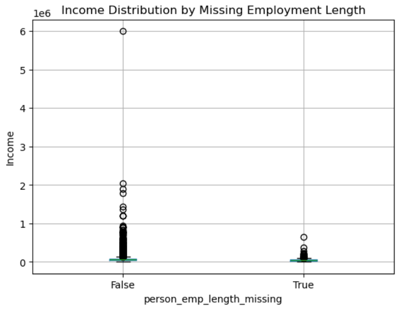
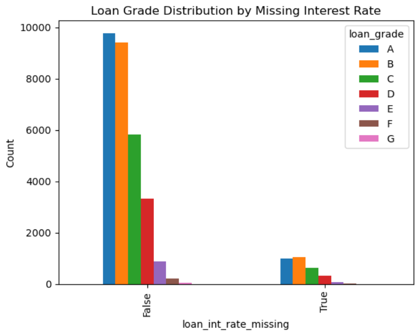
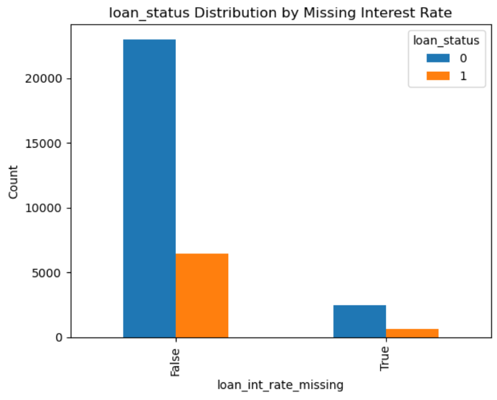
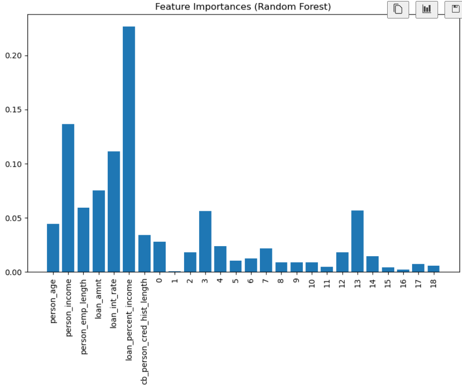
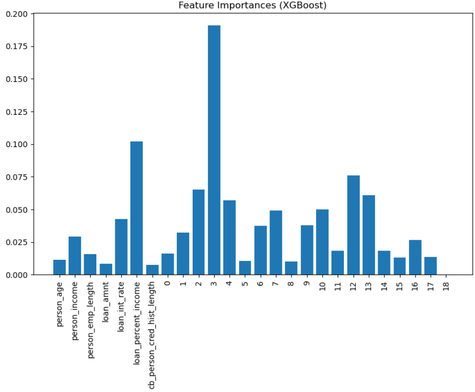

# Loan Approval Prediction

## Understanding the Dataset

### Features 

1. person_age (int64)
2. person_income (int64)
3. person_home_ownership (object)
4. person_emp_length (float64)
5. loan_intent (object)
6. loan_grade (object)
7. loan_amnt (int64)
8. loan_int_rate (object)
9. loan_status (int64) 0 -> Yes, 1-> No
10. loan_percent_income (float64)
11. cb_person_default_on_file (object)
12. cb_person_cred_hist_length (int64)

### Data correlation 

**Strong Positive Correlations:** *person_age* and *cb_person_cred_hist_length* (older people generally have longer credit history)

**Moderate Positive Correlation:** *loan_amnt* and *loan_percent_income* (People requesting larger loans to have a higher percentage of their income allocated to loan repayments)

**Weak Positive Correlation:** Most of them are weak

**Loan Status Correlation:** *loan_int_rate* and *loan_percent_income* have the strongest correlations with *loan_status*

### Missing Data

    *person_emp_length*: 895

    *loan_int_rate*: 3116

## Handling Missing Data

### Possible reasons why it is missing

#### *person_emp_length*: Currently unemloyed, self-employed, irregular employment history, or mistake

Based on this discovery, I am going to set the person_emp_length that has a null value to 0, and the income came somewhere else other than working.

Here are some screenshots of person_emp_length and income

#### *loan_int_rate*: Loan not finalized, variable interest rates, data entry issues

This is a bit tricky so I wont be using any simple impution such as mean/median since loans with missing interest rates have a higher approval rate, filling in missing values with the average or median interest rate could underestimate the actual rates for those loans. For filling these missing data I am going to try and use KNN Imputer because it considers the values of similioar loans to estimate the missing interest rates.

Here are some screenshots of some of the findings that could have some correlation but maybe not 

## Preparing the data

### Encode Categorical Features

Since *person_home_ownership* , *loan_intent*, *loan_grade*, and *cb_person_default_on_file* are objects we need to convert the categorical featues into numerical representations

## Techniques Tried

### Logistic Regression (Default) [Removing]

    Accuracy: 0.8181
    Precision: 0.6806
    Recall: 0.3035
    F1 Score: 0.4198

### Decision Tree Classifier (Default)

    Accuracy: 0.8868
    Precision: 0.7280
    Recall: 0.7628
    F1 Score: 0.7450

### Random Forest Classifer (Default)

    Accuracy: 0.9332
    Precision: 0.9780
    Recall: 0.7080
    F1 Score: 0.8214

    'person_home_ownership_MORTGAGE' = 0 
    'person_home_ownership_OTHER' = 1
    'person_home_ownership_OWN' = 2 
    'person_home_ownership_RENT' = 3
    'loan_intent_DEBTCONSOLIDATION' = 4
    'loan_intent_EDUCATION' = 5
    'loan_intent_HOMEIMPROVEMENT' = 6
    'loan_intent_MEDICAL' = 7
    'loan_intent_PERSONAL' = 8 
    'loan_intent_VENTURE' = 9 
    'loan_grade_A' = 10
    'loan_grade_B' = 11
    'loan_grade_C' = 12 
    'loan_grade_D' = 13 
    'loan_grade_E' = 14
    'loan_grade_F' = 15 
    'loan_grade_G' = 16 
    'cb_person_default_on_file_N' = 17
    'cb_person_default_on_file_Y' = 18

### Support Vector Machines (Default) [Removing]

    Accuracy: 0.7967
    Precision: 0.8302
    Recall: 0.0779
    F1 Score: 0.1424

### K-Nearest Neighbors (Default)

    Accuracy: 0.8314
    Precision: 0.6409
    Recall: 0.5053
    F1 Score: 0.5651

### Gradient Boosting Machines (Default)

    Accuracy: 0.9348
    Precision: 0.9604
    Recall: 0.7292
    F1 Score: 0.8290

    'person_home_ownership_MORTGAGE' = 0 
    'person_home_ownership_OTHER' = 1
    'person_home_ownership_OWN' = 2 
    'person_home_ownership_RENT' = 3
    'loan_intent_DEBTCONSOLIDATION' = 4
    'loan_intent_EDUCATION' = 5
    'loan_intent_HOMEIMPROVEMENT' = 6
    'loan_intent_MEDICAL' = 7
    'loan_intent_PERSONAL' = 8 
    'loan_intent_VENTURE' = 9 
    'loan_grade_A' = 10
    'loan_grade_B' = 11
    'loan_grade_C' = 12 
    'loan_grade_D' = 13 
    'loan_grade_E' = 14
    'loan_grade_F' = 15 
    'loan_grade_G' = 16 
    'cb_person_default_on_file_N' = 17
    'cb_person_default_on_file_Y' = 18

### Naive Bayes (Default) [Removing]

    Accuracy: 0.8143
    Precision: 0.6800
    Recall: 0.2708
    F1 Score: 0.3873

## Feature Selection Techniques

### Selection Top Features (10, 15, 20)

    10 - Features
    XGB -> Recall: 0.6708, F1 Score: 0.7754
    RF -> Recall: 0.6690, F1 Score: 0.7806
    
    15 - Features
    XGB -> Recall: 0.7301, F1 Score: 0.8238
    RF -> Recall: 0.7106, F1 Score: 0.8244

    20 -> Features
    XGB -> Recall: 0.7239, F1 Score: 0.8238
    RF -> Recall: 0.7168, F1 Score: 0.8278

### Percentile-Based Selection

    XGB
    Accuracy: 0.9022
    Precision: 0.8507
    Recall: 0.6655
    F1 Score: 0.7468

    RF
    Accuracy: 0.9008
    Precision: 0.8448
    Recall: 0.6646
    F1 Score: 0.7439

### Recursive Feature Elimination (RFE)
